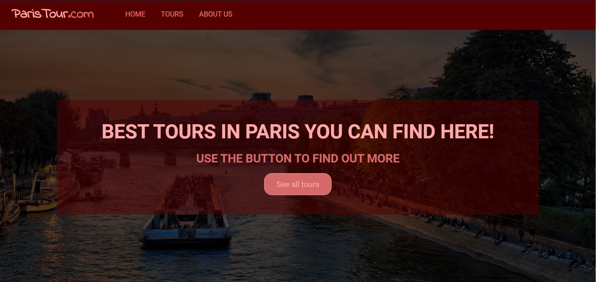
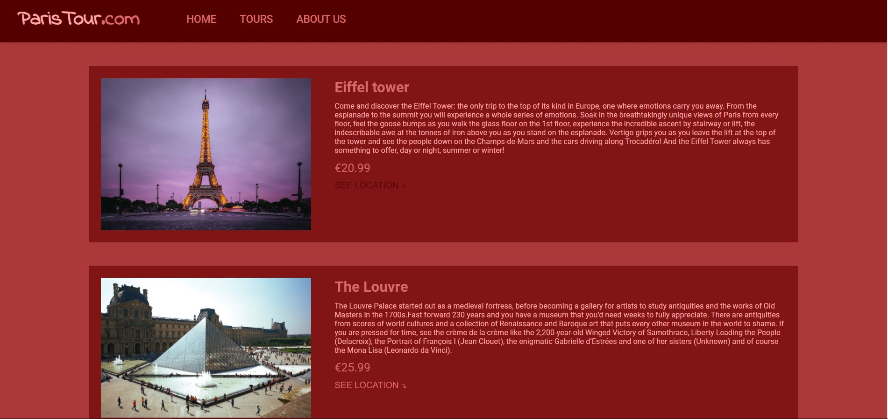
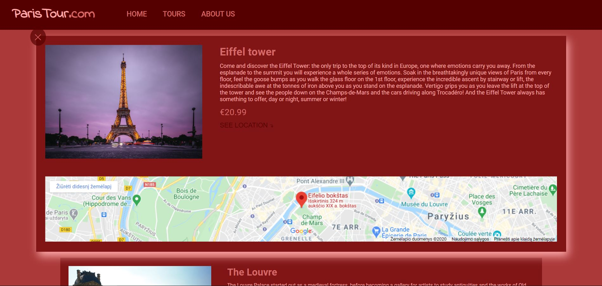

<h1>Paris Travel destinations</h1>
<h2>Made with React and SCSS</h2>

 Fully functional front-end made as a representative website for Paris tour guid company. Made using SASS components and development with React, a best-in-class JavaScript library for building user interfaces. Used advanced CSS styles to make pages maximal representative and dynamic using CSS and JavaScript. All effects and popups are made with JavaScript. Web pages are hosted using Netlify. Also used the Git source control that allows you to record changes to files over time and allows you to view changes and specific versions of those files later on. All web page is made using the latest CSS technologies like Grid system. With a grid system, this webpage is maximum responsive for different mobile devices with a minimum media query.

<h5>Check link hosted with netlify:  <a href="https://paris-tours.netlify.app/" target="_blank">Demo</a>  </h5>
 

